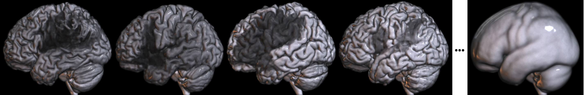

## About

This repository includes scripts to process and analyze images from the original 228 individuals in the [Aphasia Recovery Cohort (ARC) Dataset](https://openneuro.org/datasets/ds004512/), as well as the resulting images derived from the processing. The goal of this repository is to provide a minimal starting point for analyzing the ARC. This acute dataset complements the [Stroke Outcome Optimization Project](https://github.com/neurolabusc/StrokeOutcomeOptimizationProjectDemo) from individuals with chronic impairments.  This educational resource illustrates how to process clinical datasets stored in the [BIDS](https://bids.neuroimaging.io/) format. Our hope is that more sophisticated methods can improve clinical lesion mapping, spatial processing and prediction. The current repository reflects the first tranche of data, with upcoming (hidden) releases allowing fair competitions future refinements.

### Scripts

The Matlab Scripts require Matlab, [SPM12](https://www.fil.ion.ucl.ac.uk/spm/software/download/), and the [clinical toolbox](https://github.com/neurolabusc/Clinical) installed. All scripts require the raw data provided from the [Aphasia Recovery Cohort (ARC)](https://openneuro.org/datasets/ds004512/). Users will need to adjust the paths for the scripts to match their file system.

The Matlab scripts must be run first and in order:

 - `bidsHarvest.m` : this Matlab script copies the T1w images, T2w images, and lesion maps (drawn on the T2w). If both the T1w and T2w images wwere acquired on the same day, the days post-stroke will be listed as the session number (e.g. for subject M2012: `sub-M2012_ses-1158`). In contrast, scans acquired at different dates will have more complicated filenames (e.g. participant M2004 had the T1w scan acquired 755 days post stroke, while the T2 was acquired 524 days post stroke: `sub-M2004_ses-755x524`). You must specify the location of the BIDS format input (`bidsDir`) and the output (`outDir`) paths.
 - `lesionNorm.m` : this Matlab script coregisters the T2w image to the T1w image, transforming the lesion to T1w space. The T1w scan is then healed using tissue from the contralesional hemisphere, and the resulting healed T1w image is normalized into standard space. This transform is used to warp the lesion into standard space. The T1w image is also brain extracted based on estimates of gray and white matter from the unified segmentation-normalization. One should specify the input folder (`inDir`, which is the `outDir` for bidsHarvest), and output folder (`outDir`) as well as a path for temporarily storing intermediate images (`tempDir`).

The Python scripts assume the Matlab scripts have been run. Each file will require the user to specify paths for their file system.

 - `nii2meanLesion.py` : Creates an average lesion map (showing incidence of injury).
 - `nii2meanT1w.py` : Creates an average T1w image.
 - `bids_bitmaps.py` : Creates one PNG image per participant allowing visual inspection to determine that the normalization performed well.
 - `lesion2artery.py` : creates a tab-separated value file named `artery.tsv` to identify the proportion of each region of the [Arterial Atlas](https://www.nitrc.org/projects/arterialatlas) that has been damaged for each individual. Note that this script can be modified to use the included `jhu156` [Anatomical Atals](https://pubmed.ncbi.nlm.nih.gov/22498656/). 
 - `clean_artery_tsv.py` : given the `artery.tsv` file, create a new tsv file named `artery_cleaned.tsv` that only contains columns with variability. By default, it uses a [5% sufficient affection threshold](https://www.ncbi.nlm.nih.gov/pmc/articles/PMC6866937/).
 - `clean_participant_tsv.py` : given a BIDS format `participants.tsv` file, create a new file `participants_cleaned.tsv` that only contains the variables of interest. Without modification, this script will preserve the first, third and fifth columns (`subject_id`, `age` and `nihss`) from `participants.tsv` in the new file `participants_cleaned.tsv`.
 - `merge_artery_tsv.py` concatenates the files `participants_cleaned.tsv` and `artery_cleaned.tsv` to create `merged_artery_participants.tsv`.
 - `deep_learn.py` : uses lesion and patient age to infer patient's impairment on the Western Aphasia Battery.

By default, the `deep_learn.py` should report both neural network and support vector regression predictions:

```
Neural Network - Correlation (R): 0.6295585315625406, p-value: 2.3596445566493573e-26
SVR - Correlation (R): 0.6536509849052542, p-value: 6.30552168042444e-29
```

Note that slightly better numerical performance can be achieved by uncommenting the line `columns_to_keep = ['age_at_stroke', 'lesion_volume', rv]`. This constrained model ignores regional injury, and reflects the [potency of lesion volume to predict generalized impairment measures](https://pubmed.ncbi.nlm.nih.gov/37741168/). From first principles, one might expect additional features to improve performance as the dataset size is increased and more specific behavioral measures are provided.  The performance of this simpler model is:

```
Neural Network - Correlation (R): 0.6956690572689396, p-value: 5.045103798777254e-34
SVR - Correlation (R): 0.6798267891041169, p-value: 5.302344539620752e-32
```


### NIFTI

These are the derived [NIfTI format](https://brainder.org/2012/09/23/the-nifti-file-format/) images created by the lesionNorm script. These can be viewed with many neuroimaging tools, including our [web-based drag-and-drop NiiVue](https://niivue.github.io/niivue/features/basic.multiplanar.html).

 - `wbsub-M*_T1w.nii.gz` : anatomical T1-weighted MRI scan from each participant warped (`w`) to standard space and brain-extracted (`b`). 
 - `wsub-M*_lesion.nii.gz` : map of injury from each individual warped to standard space.
 - `jhu156.nii.gz` : atlas of brain regions, in same space as individual images.
 - `jhu156.txt` : Text file which provides name and index number for brain regions in the atlas.
 - `T1_mean_289.nii.gz` : Average T1-weighted image for all participants.
 - `lesion_mean_289.nii.gz` : Average lesion map for all participants.
 


### PNG

These bitmap images are created by the `bids_bitmaps.py` and aid quality assurance for the image processing.

 - `wsub-M*.png` provide orthogonal slices (axial, sagittal, coronal) and volume rendered images for the warped and brain extracted T1-weighted MRI scan with the lesion shown as translucent red. The cross-hair is positioned at the center of mass for the lesion. Since brain-extraction is derived from the unified normalization-segmentation algorithm, an accurate brain extraction and cortical surface rendering is consistent with an accurate normalization to standard space.

